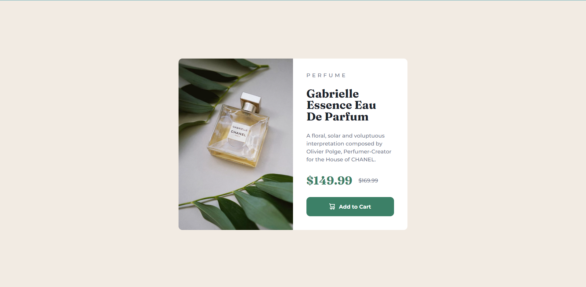

# Frontend Mentor - Product preview card component solution

This is a solution to the [Product preview card component challenge on Frontend Mentor](https://www.frontendmentor.io/challenges/product-preview-card-component-GO7UmttRfa). Frontend Mentor challenges help you improve your coding skills by building realistic projects. 

## Table of contents

- [Overview](#overview)
  - [The challenge](#the-challenge)
  - [Screenshot](#screenshot)
  - [Links](#links)
- [My process](#my-process)
  - [Built with](#built-with)
  - [What I learned](#what-i-learned)
  - [Continued development](#continued-development)
  - [Useful resources](#useful-resources)
- [Author](#author)
- [Acknowledgments](#acknowledgments)

## Overview
This is my solution to frontendmentor.io's product preview card component challenge. This challenge mainly focuses on writing HTML and CSS code. This product preview card component consists of a picture of the product and some info.

### The challenge

Users should be able to:

- View the optimal layout depending on their device's screen size
- See hover and focus states for interactive elements

### Screenshot



### Links

- [Solution](https://your-solution-url.com)
- [Live Site](https://stk-product-card.netlify.app)

## My process

I used vanilla HTML and CSS to build this project and it turned out nice. This webpage consists of a card which is an article element that nests two divs where one nests a picture element and the other is the container for the product info. There, you can see information of the product including the type, name, description and price.

### Built with

- Semantic HTML5 markup
- CSS custom properties
- Flexbox

### What I learned

How to use media queries properly.

```css
@media (max-width: 767px) {
  .card {
    flex-direction: column;
    width: 340px;
    height: 610px;
  }

  .image-card,
  .product-info-card {
    width: 100%;
    height: auto;
  }

  .product-image {
    border-radius: 10px 10px 0 0;
  }

  .product-info-card {
    border-radius: 0 0 10px 10px;
    padding: 25px;
  }

  .cart-button {
    width: 295px;
  }
}
```

### Continued development

I want to continue learning Flexbox and mobile-first development.

### Useful resources

- [ChatGPT](https://chat.openai.com) - This bot is amazing! I used it when I neeeded to align items properly.

## Author

- Frontend Mentor - [@shinthantkn](https://www.frontendmentor.io/profile/shinthantkn)
- Twitter - [@shinfluencer](https://www.twitter.com/shinfluencer)

## Acknowledgments

All by myself!
